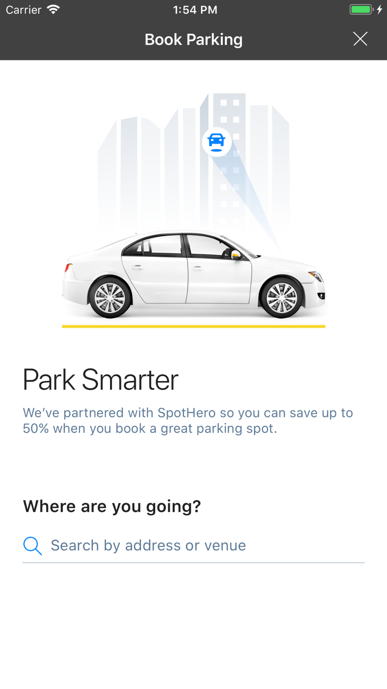
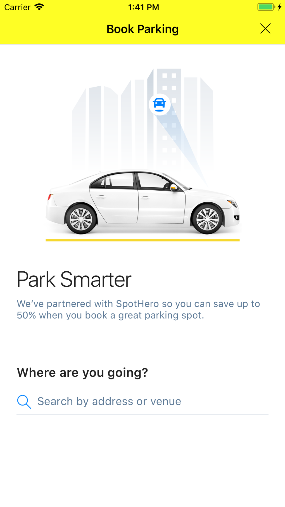

# iOS-Partner-SDK

The SpotHero iOS Partner SDK allows your users to purchase parking through SpotHero with minimal setup by your development team.

## Before You Start

To add the SpotHero iOS Partner SDK to your application, you will need a SpotHero Partner Key. To inquire about partnering with us, please fill out [this form](https://docs.google.com/forms/d/e/1FAIpQLSf3eErKlAwvqDUdgNWtxg4iTq2Deocoouwp-qLdD24DBWz9jQ/viewform), and someone from our Partnerships program will reach out to you.

If you've already got a SpotHero Partner Key, you're ready to start.

## Getting Started

Use [CocoaPods](https://guides.cocoapods.org/using/getting-started.html) to install our SDK. Follow the guide at the link to get started if you do not already have CocoaPods installed.

Add the following line to your [Podfile](https://guides.cocoapods.org/using/the-podfile.html), within the target you wish to add our SDK to:

```ruby
target 'YourAppTargetName'
  pod 'SpotHero_iOS_Partner_SDK', '~>1.0'
end
```

**NOTE**: Since our SDK is in Swift, you _must_ use the [`use_frameworks!`](https://guides.cocoapods.org/syntax/podfile.html#use_frameworks_bang) flag in your Podfile, or it won't build.

Using the terminal, `cd` into the directory where your `Podfile` is located.  Run `pod install`, and the current version of our SDK will be installed.

Make sure you follow CocoaPods' instructions and open the `.xcworkspace` file instead of the `.xcodeproj` file, or your code won't build.

**NOTE**: The current version SDK uses Swift 3.0.1, and requires a version of Xcode 8.2 or higher to build. If you need to use something compatible with anything down to Xcode 7.3, please use version [`0.1.3`](https://github.com/spothero/Partner-SDK-iOS/releases/tag/0.1.3) of the SDK, which builds in Swift 2.2 and 2.3. More detailed information about Swift versioning is available in our [note on Swift Versions](#a-note-on-swift-versions).

## Using The SDK in your Code

To use the SDK or its elements in a Swift file, add the following line to the top of your file:

```swift
import SpotHero_iOS_Partner_SDK
```

To use the SDK or its elements in Objective-C file, add this line to the top of your file instead:

```objectivec
@import SpotHero_iOS_Partner_SDK;
```
### Launching the SDK

The SpotHero SDK is implemented as a singleton which can be launched from any `UIViewController` subclass. It will be presented modally. There is only one **required** property which must be set:

- `partnerApplicationKey: String`: Your application's partner key.

If a partner application key is not provided, during debugging you will hit an assertion failure and in production, the SDK will not be launched.

The absolute bare minimum implementation, assuming you have a button hooked up to this IBAction, is as follows:

```swift
@IBAction private func launchSDKButtonPressed(sender: AnyObject) {
  let spotHeroSDK = SpotHeroPartnerSDK.SharedInstance        

  //Partner key: REQUIRED
  spotHeroSDK.partnerApplicationKey = "Your SpotHero Partner Key Here"

  // Present SDK as modal
  spotHeroSDK.launchSDK(fromViewController: self)

  // OR if you need to access the viewController

  // Launch SDK and get the view controller from a completion block
  spotHeroSDK.launchSDK {
    viewController in
    if let viewController = viewController {
      self.navigationController?.pushViewController(viewController, animated: true)
    }
  }
}
```

The sample application for this pod includes an example of how to get the simplest integration up and running.

If you use the default options, the SDK should launch looking something like this:



## Configurable Options

There are a couple of options you may configure to have the SDK look a bit more at home in its host application. They are:

- `tintColor: UIColor`: The tint color to use for the background of the nav bar.
- `textColor: UIColor`: The text color to use on buttons and titles in the navigation bar.

Here is an example of that same `IBAction` with the optional items set up:

```swift
@IBAction private func launchSDKButtonPressed(sender: AnyObject) {
	let spotHeroSDK = SpotHeroPartnerSDK.SharedInstance

	//Partner key: REQUIRED
	spotHeroSDK.partnerApplicationKey = "Your SpotHero Partner Key Here"

	//Text Color for nav bar: OPTIONAL
	spotHeroSDK.textColor = .black

	//Tint color for nav bar: OPTIONAL
	spotHeroSDK.tintColor = .yellow

	//Ignition, and liftoff!
	spotHeroSDK.launchSDKFromViewController(self)
}
```

And here is what it would look like on launch:



## Debugging Help

If you are running into problems and you would like to see a very, very large amount of detail about the calls going to and from the SpotHero server, you may change the `debugPrintInfo` property on the SDK singleton to `true`.

For security reasons, we ask that you ensure this is **not** set to `true` in any release builds. The default value is `false`, so if you do not actively change it, you're fine.

## A note on Swift Versions

One thing about Swift that's a bit of a pain until it becomes ABI stable is that your code and *all* dependencies must be using the same version of Swift. This SDK is entirely written in Swift, so make sure you figure out if you have any other Swift-based dependencies or any of your own code tied to a particular version of Swift.

If you are running Xcode 8.2 or higher:

- Use the current version of the SDK, which is using Swift 3.

If you are running Xcode 8.1.x down to Xcode 7.3.x:

- Use version [`0.1.3`](https://github.com/spothero/Partner-SDK-iOS/releases/tag/0.1.3) of the SDK, which supports both Swift 2.2 **and** 2.3. Follow the instructions in the version of this document in the linked tag to ensure proper installation.

Note that if you are running anything below Xcode 7.3.x, you will not be able to build our SDK, since Swift 2.3 is not supported in those versions.

We're committed to ensuring timely updates to the SDK when new versions of Swift are made available through Xcode. Please reach out to the SpotHero engineering team through your partnership coordinator if you need access to a pre-release version.
